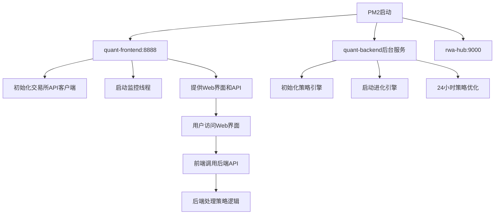
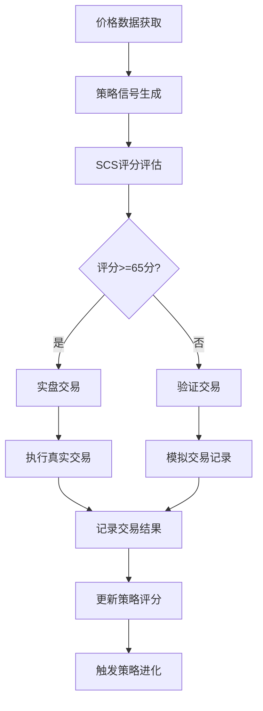
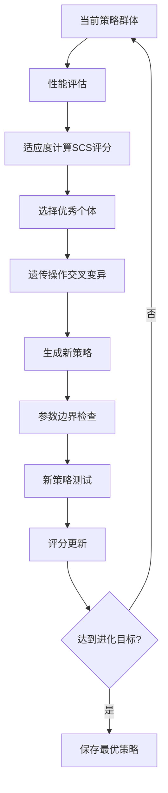

# 量化交易系统架构分析与功能模块总结

## 🏗️ 系统架构概述

### 前后端分离架构
本系统采用前后端分离的微服务架构，通过PM2进程管理器运行：

```
┌─────────────────────────────────────────────────────────────┐
│                     PM2 进程管理层                           │
├─────────────────┬─────────────────┬─────────────────────────┤
│  quant-frontend │  quant-backend  │       rwa-hub          │
│   (web_app.py)  │(quantitative_   │   (独立应用)            │
│   端口: 8888    │service.py)      │   端口: 9000           │
│                 │   (纯后台服务)   │                        │
└─────────────────┴─────────────────┴─────────────────────────┘
         │               │                     │
         ▼               ▼                     ▼
┌─────────────────┬─────────────────┬─────────────────────────┐
│   Web前端界面    │   策略引擎核心   │     RWA资产管理         │
│   HTTP API      │   数据处理      │                        │
│   实时监控      │   交易执行      │                        │
└─────────────────┴─────────────────┴─────────────────────────┘
```

## 📱 应用模块详细分析

### 1. **前端应用 (quant-frontend - web_app.py)**

**端口**: 8888  
**职责**: Web界面展示、HTTP API接口、用户交互

#### 主要功能模块:

##### 🌐 Web界面模块
- **套利监控页面** (`/arbitrage.html`) - 加密货币套利机会监控
- **量化交易页面** (`/quantitative.html`) - 策略管理和交易控制
- **操作日志页面** (`/operations-log.html`) - 系统操作记录

##### 🔌 API接口模块  
```python
# 核心API路由
/api/quantitative/strategies          # 策略管理
/api/quantitative/system-status       # 系统状态
/api/quantitative/system-control      # 系统控制
/api/quantitative/evolution-log       # 进化日志
/api/quantitative/signals             # 交易信号
/api/account/balances                 # 账户余额
/api/arbitrage/*                      # 套利相关
```

##### 💱 交易所API模块
- **多交易所支持**: Binance, OKX, Gate.io, Huobi等
- **实时价格获取**: 缓存30秒，支持多币种
- **账户余额管理**: 缓存10秒，自动刷新
- **连接池管理**: CCXT连接池，自动清理空闲连接

##### 📊 数据监控模块
- **实时价格监控**: 5秒间隔监控价格变化
- **套利机会检测**: 跨交易所价差分析
- **资源使用监控**: CPU、内存、磁盘使用率

---

### 2. **后端服务 (quant-backend - quantitative_service.py)**

**职责**: 策略引擎核心、数据处理、交易执行逻辑

#### 主要功能模块:

##### 🧬 策略进化引擎 (EvolutionaryStrategyEngine)
```python
# 核心进化机制
- 遗传算法优化: 选择、交叉、变异
- 多代进化: 自动迭代优化参数
- 适应度评估: SCS评分系统(0-100分)
- 精英保留: 保护高分策略
```

##### 📈 策略类型支持
```python
1. momentum (动量策略)
   - 参数: lookback_period, threshold, quantity
   - 原理: 利用价格动量进行交易

2. mean_reversion (均值回归策略)  
   - 参数: lookback_period, std_multiplier, quantity
   - 原理: 价格偏离均值时反向交易

3. breakout (突破策略)
   - 参数: lookback_period, breakout_threshold, quantity
   - 原理: 价格突破阻力/支撑位时跟随

4. trend_following (趋势跟踪策略)
   - 参数: lookback_period, trend_threshold, quantity
   - 原理: 识别并跟随长期趋势

5. high_frequency (高频交易策略)
   - 参数: quantity, min_profit, volatility_threshold
   - 原理: 高频小额交易获取微利
```

##### 💰 资金管理模块
```python
# 智能资金分配
- 基于策略评分的资金分配
- 风险管理和止损机制
- 动态调整交易量
- 实盘/验证模式切换
```

##### 🎯 SCS评分系统
```python
# 综合评分算法 (0-100分)
- 胜率权重: 30%
- 夏普比率: 25%  
- 盈利因子: 20%
- 最大回撤: 15%
- 波动率: 10%
```

##### 🔄 自动化管理
```python
# 24小时自动运行
- 策略自动选择和启用
- 参数自动优化
- 性能自动评估
- 实盘交易资格管理
```

---

### 3. **RWA应用 (rwa-hub)**

**端口**: 9000  
**职责**: RWA (Real World Assets) 资产管理（独立应用模块）

---

### 4. **实时监控模块 (real_time_monitor.py)**

**WebSocket服务**: localhost:8765  
**职责**: 实时数据推送、系统状态监控

#### 监控功能:
```python
# 策略性能监控
- 实时策略表现数据
- 交易执行状态
- 进化进度跟踪

# 系统指标监控  
- CPU、内存、磁盘使用率
- 数据库连接状态
- 网络IO统计

# WebSocket推送
- 策略更新事件
- 系统指标变化
- 进化日志事件
```

---

## 🔄 系统运行逻辑流程

### 启动流程


### 交易决策流程


### 策略进化流程


## 🗄️ 数据存储架构

### PostgreSQL数据库表结构
```sql
-- 核心表
strategies                    -- 策略信息
strategy_trades              -- 交易记录  
strategy_evolution_history   -- 进化历史
strategy_optimization_logs   -- 优化日志
balance_history             -- 余额历史
system_status               -- 系统状态
trading_signals             -- 交易信号

-- 配置表
strategy_management_config   -- 策略管理配置
auto_trading_config         -- 自动交易配置
```

### 文件存储
```
data/                       -- 数据文件目录
├── arbitrage_history.json  -- 套利历史数据
├── verification_reports/   -- 验证报告
└── backups/               -- 备份文件

logs/                      -- 日志文件目录
├── pm2/                   -- PM2进程日志
└── application/           -- 应用日志
```

## 🔧 配置管理

### 环境变量配置
```bash
# API密钥配置
BINANCE_API_KEY=xxx
BINANCE_SECRET_KEY=xxx
OKX_API_KEY=xxx
# ... 其他交易所配置

# 数据库配置
DB_HOST=localhost
DB_NAME=quantitative
DB_USER=quant_user
DB_PASSWORD=123abc74531
```

### 动态配置
```json
// auto_trading_config.json
{
  "enabled": true,
  "mode": "auto",
  "max_strategies": 5,
  "real_trading_threshold": 65.0,
  "evolution_interval": 30
}
```

## 📊 性能特点

### 优势
1. **高可用性**: PM2进程管理，自动重启
2. **实时性**: WebSocket实时数据推送
3. **智能化**: AI驱动的策略进化
4. **安全性**: 分层风控，验证交易
5. **可扩展**: 微服务架构，模块化设计

### 技术栈
- **后端**: Python + Flask + asyncio
- **数据库**: PostgreSQL + Redis缓存
- **前端**: HTML5 + JavaScript + WebSocket
- **进程管理**: PM2
- **API集成**: CCXT交易所接口
- **机器学习**: 遗传算法 + 量化策略

## 🎯 当前运行状态

### 服务状态
```
✅ quant-frontend (PID: 66983) - 在线 11分钟
✅ quant-backend (PID: 69944) - 在线 10秒  
✅ rwa-hub - 在线 12分钟
```

### 访问地址
```
🌐 量化交易系统: http://47.236.39.134:8888/quantitative.html
🌐 套利监控系统: http://47.236.39.134:8888/arbitrage.html  
🌐 RWA资产管理: http://47.236.39.134:9000
```

### 关键指标
- **策略总数**: 1,034个
- **启用策略**: 449个符合交易条件
- **实盘交易**: 需要评分≥65分
- **进化状态**: 第52代第4轮持续进化中
- **WebSocket**: localhost:8765 (实时监控)

---

## 🚀 系统价值

这是一个**企业级量化交易平台**，具备：
- **自主进化的AI策略引擎**
- **多交易所套利监控系统**  
- **完整的风控和资金管理**
- **7x24小时无人值守运行**
- **Web界面的可视化管理**

通过前后端分离的架构设计，实现了高可用、高性能、智能化的量化交易解决方案。 